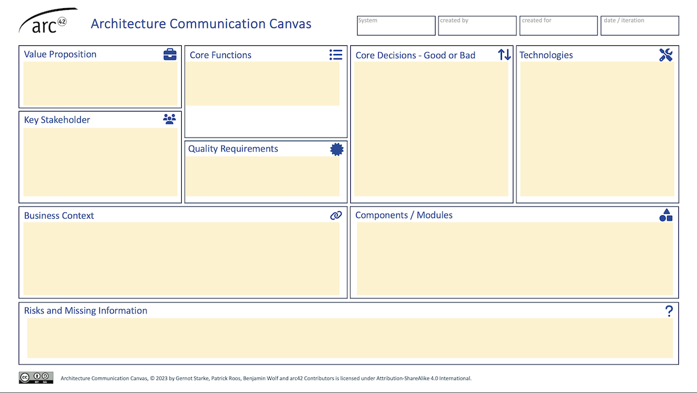
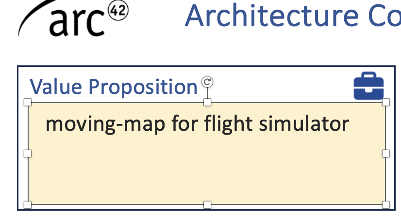
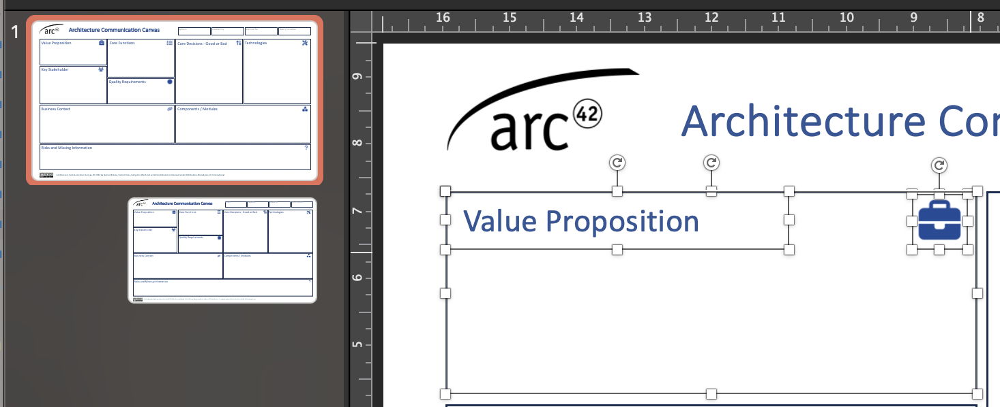

>This page is currently under (heavy) construction. We have collected quite a pile of questions and answers, and are currently busy getting these onto this website... stay tuned.

## Do you prefer Flat White or Cappuccino?
Ben and Patrick usually drink Flat White whenever possible.
Gernot prefers Cappuccino because it's not as strong (and allows him to drink more of it!).

## What is the relation of the canvas to arc42?

>Both AIC (architecture inception canvas) and ACC (architecture communication canvas) are perfectly compatible with the well-established arc42 template.

Either of these canvas types can be a starting point for more extensive or elaborate documentation of an architecture.

Additionally, the arc42 open source organization is maintaining, supporting and hosting these canvases.

## How to use the PowerPoint® version?

The pptx version of the canvas looks identical to other formats:

figure: pptx-version of the Architecture Communication Canvas

Using it is actually straightforward: Just click into the _yellowish_ rectangles and start typing, as shown below:

figure: typing in the pptx version

>The downloadable version has two slides - one with _yellowish_ rectangles to type in, and a second with these rectangles in white (which makes them invisible...)

All the rectangles, headers, icons are embedded into the slide master. In case you need to change these, you have to enter the "slide master" view, as shown next:

figure: (excerpt from) the slide-master

## How shall I create a canvas?

**With a group of people** 
We found the canvas to be a highly effective _collaboration_ tool, sparkling mutual understanding in a group of people.

* Therefore, get together with some people have a _stake_ in the system under consideration, some interest or motivation
* With your tool of choice (see below, we prefer a huge sheet of paper) start brainstorming the different sections of the canvas.

## How do the different canvas types relate to each other?

The [_Architecture Inception Canvas_](https://canvas.arc42.org/architecture-inception-canvas) provides an efficient and collaborative approach to defining your software architecture playground. It is an ideal tool for designing and conceptualising new systems from scratch, especially for new approaches to software development.

The [_Architecture Communication Canvas_](https://canvas.arc42.org/architecture-communication-canvas) is designed for communicating existing architectures. It is the "elevator pitch" of software architecture and provides the most compact way to explain and communicate your system. It helps communicate the key elements of existing software architectures.

Both canvases are fully compatible with the [arc42 template](https://arc42.org/overview).

## What tool(s) shall I use?

1. Try pen and paper first, electronic or digital tools later.
2. Try the most collaborative tool you have in your toolbox. We like tools like [Miro](https://miro.com), [ConceptBoard](https://conceptboard.com/), [Mural](https://www.mural.co/), [FigJam](https://www.figma.com/de/figjam/team-collaboration/) or [Jamboard](https://jamboard.google.com)

Focus on content, not on tooling!
