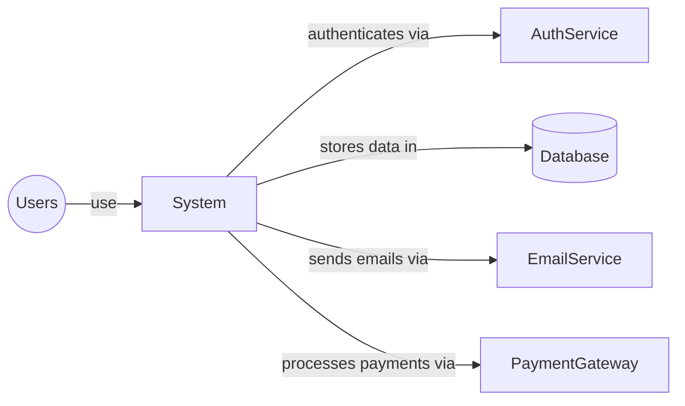

> This is a template for a Architecture Communication Canvas (ACC, see https://canvas.arc42.org) using a code based approach with Markdown, HTML/CSS and mermaid diagrams.
>
> **Getting Started**
>
> To get started with this template, you'll need a few VSCode extensions:
>
> 1. **Markdown Preview Enhanced** - For rendering the markdown with embedded HTML/CSS
> 2. **Mermaid Preview** - For previewing mermaid diagrams
>
> You can create a `.vscode/extensions.json` file in your project root with these recommended extensions:
> ```json
> {
>    "recommendations": [
>        "bierner.markdown-mermaid",
>        "yzhang.markdown-all-in-one"
>    ]
>} 
>```
> Hint: Mermaid charts are supported by GitHub
>

# Template
*System: ... | Created by: ... | Date/Iteration: ... |*

## Value Proposition 💼
*Major objectives.<br>What value does the system deliver?<br>What are the major business goals?*

## Core Functions 📋
*What are the most important functions?<br>What activities or processes does it offer?*

## Key Stakeholder 🧑‍🧑‍🧒
*For whom are we creating value?<br>
Who is paying for development?<br>
Who is paying for operations?<br>
Who are our most important customers?<br>
Who are our most important contributors?*

## Quality Requirements ⭐️
*Speed, scalability, reliability, usability, security, safety, capacity or similar*

## Business Context 🔗
*What are the most important external interfaces or neighboring systems?*


## Core Decisions - Good or Bad 🚦
*Which decisions lead to the current state of the system?*

## Technologies 🛠️
*Important technologies used for development and operation*

## Components / Modules 🧊
*Major building blocks of the system*

## Core Risks and Missing Information ❓
*Potential problems and risks?<br>What information is missing or has gotten lost?<br>What is hindering the team from delivering better value faster?*

 Software Architecture Canvas is licensed under Attribution-ShareAlike 4.0 International. 
[https://canvas.arc42.org](https://canvas.arc42.org)

## Markdown
```markdown
> This is a template for a Architecture Communication Canvas (ACC, see https://canvas.arc42.org) using a code based approach with Markdown, HTML/CSS and mermaid diagrams.
>
> **Getting Started**
>
> To get started with this template, you'll need a few VSCode extensions:
>
> 1. **Markdown Preview Enhanced** - For rendering the markdown with embedded HTML/CSS
> 2. **Mermaid Preview** - For previewing mermaid diagrams
>
> You can create a `.vscode/extensions.json` file in your project root with these recommended extensions:
> ```json
> {
>    "recommendations": [
>        "bierner.markdown-mermaid",
>        "yzhang.markdown-all-in-one"
>    ]
>} 
>```
> Hint: Mermaid charts are supported by GitHub
>
*System: ... | Created by: ... | Date/Iteration: ... |*

## Value Proposition 💼
*Major objectives.<br>What value does the system deliver?<br>What are the major business goals?*

## Core Functions 📋
*What are the most important functions?<br>What activities or processes does it offer?*

## Key Stakeholder 🧑‍🧑‍🧒
*For whom are we creating value?<br>
Who is paying for development?<br>
Who is paying for operations?<br>
Who are our most important customers?<br>
Who are our most important contributors?*

## Quality Requirements ⭐️
*Speed, scalability, reliability, usability, security, safety, capacity or similar*

## Business Context 🔗
*What are the most important external interfaces or neighboring systems?*
> ```mermaid
>  graph LR
>     Users((Users))-->|use|System
>     System-->|authenticates via|AuthService
>     System-->|stores data in|Database[(Database)]
>     System-->|sends emails via|EmailService
>     System-->|processes payments via|PaymentGateway
> ```

## Core Decisions - Good or Bad 🚦
*Which decisions lead to the current state of the system?*

## Technologies 🛠️
*Important technologies used for development and operation*

## Components / Modules 🧊
*Major building blocks of the system*

## Core Risks and Missing Information ❓
*Potential problems and risks?<br>What information is missing or has gotten lost?<br>What is hindering the team from delivering better value faster?*

 Software Architecture Canvas is licensed under Attribution-ShareAlike 4.0 International. 
[https://canvas.arc42.org](https://canvas.arc42.org)
```